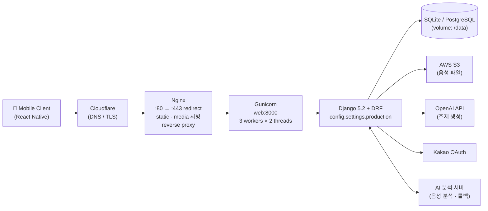
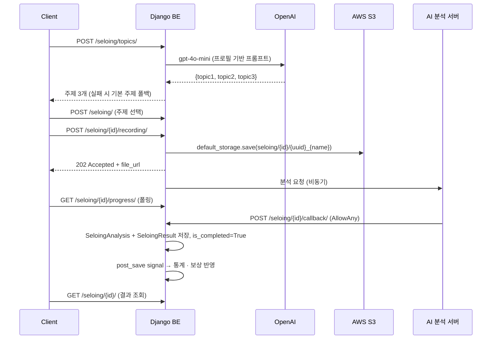

# 🎙️ Selo v2 - Backend API

**Selo v2**는 AI 기반 음성 분석을 통한 스피치 학습 플랫폼의 백엔드 API 서버입니다.  
사용자의 음성을 분석하여 발화 품질을 평가하고, 개선 피드백을 제공하는 "셀로잉(Seloing)" 서비스를 제공합니다.

## 🚀 주요 기능

### 👤 사용자 관리 (Users)
- **회원가입/로그인/로그아웃**: Token 기반 인증
- **프로필 관리**: 사용자 정보 조회/수정/탈퇴
- **온보딩 지원**: 사용자 유형별 맞춤 설정
- **셀로잉 이력**: 완료된 학습 세션 기록 관리

### 🎯 셀로잉 학습 (Seloing)
- **주제 생성**: AI 기반 맞춤형 주제 생성
- **학습 세션**: 음성 녹음 및 AI 분석 요청
- **실시간 진행상황**: 분석 상태 추적
- **결과 분석**: 종합적인 발화 품질 평가
  - 반복 표현 분석
  - 주제 연관성 평가  
  - 발화 안정성 측정
  - 불필요한 추임새 검출

### 📊 통계 및 랭킹 (Stats)
- **개인 통계**: 학습 진도, 점수 추이, 성과 분석
- **글로벌 랭킹**: 전체 사용자 대비 순위 (3회 이상 학습자만)
- **자동 업데이트**: 학습 완료 시 실시간 통계 반영
- **조건부 집계**: 초보자 점수는 전체 평균에서 제외

### 💡 지식 및 팁 (Tips)
- **학습 가이드**: 효과적인 스피치 학습 방법
- **실용 팁**: 상황별 커뮤니케이션 노하우

### 📱 미디어 관리 (Medias)
- **프로필 이미지**: 사용자 프로필 사진 관리

## 🏛️ 시스템 아키텍처

### 전체 구성



- **Nginx** — TLS 종료(Cloudflare Origin Cert), 정적/미디어 파일 직접 서빙, `/` 전체를 `web:8000`으로 프록시. 업로드 상한 20MB.
- **Gunicorn + Django** — `entrypoint.sh`가 `migrate` → `collectstatic` → `gunicorn` 순으로 부팅.
- **Healthcheck** — `GET /api/healthz`가 200을 반환해야 Nginx 컨테이너가 기동 (`depends_on: service_healthy`).

### 레이어 구조

요청은 아래 순서로 처리됩니다.

```
HTTP Request
   │
   ├─ CorsMiddleware → Security → Session → CSRF → Auth (Django Middleware)
   │
   ├─ Authentication   TokenAuthentication → JWTAuthentication (순차 시도)
   ├─ Permission       IsAuthenticated (기본값) / AllowAny / IsAdminUser
   │
   ├─ View             APIView 기반 (class-based, 앱별 views.py)
   ├─ Serializer       입력 검증 · 출력 직렬화
   ├─ Service / Utils  외부 API 호출(services.py), 통계 계산(utils.py)
   ├─ Model            CommonModel 상속 (created_at / updated_at)
   │
   └─ Signal           post_save 훅으로 통계 · 보상 자동 처리
```

### Django 앱 구성

| 앱 | 책임 | 핵심 모델 |
|---|---|---|
| `config/` | 프로젝트 설정, 루트 URL 라우팅, WSGI/ASGI | — |
| `common/` | 전 앱이 상속하는 추상 베이스 모델 | `CommonModel` (abstract) |
| `users/` | 인증, 프로필, 온보딩, JWT 토큰 수명주기 | `User`, `UserType`, `UserSelloingInfo`, `OnboardingSession`, `OnboardingMessage`, `RefreshToken`, `BlacklistedToken` |
| `seloing/` | 주제 생성, 학습 세션, AI 분석 결과 수신 | `Topic`, `Seloing`, `SeloingAudio`, `SeloingAnalysis`, `SeloingResult`, `SeloingReward` |
| `stats/` | 개인/글로벌 통계 집계, 랭킹 | `UserStats`, `GlobalStats` |
| `tips/` | 학습 팁 및 지식 콘텐츠 | `Tips`, `Knowledge` |
| `medias/` | 이미지 업로드 및 프로필 이미지 | `Image`, `ProfileImage` |
| `auth/`, `knowledge/` | URL 전용 모듈 (뷰는 `users` / `tips` 재사용) | — |

### 설정 분리

`config/settings/` 패키지로 환경별 설정을 분리합니다.

| 모듈 | 용도 | 주요 차이 |
|---|---|---|
| `base.py` | 공통 설정 | INSTALLED_APPS, DRF, JWT 수명, 외부 API 키 |
| `development.py` | 로컬 개발 | `DEBUG=True`, SQLite, `CORS_ALLOW_ALL_ORIGINS` |
| `production.py` | 운영 | `DEBUG=False`, HSTS/SSL 리다이렉트, `DATABASE_URL`·`POSTGRES_HOST` 감지 후 Postgres 전환 |

- `manage.py` → 기본값 `config.settings.development`
- `config/wsgi.py` → 기본값 `config.settings.production`

시크릿은 전부 `os.getenv()`로 주입합니다 (`SECRET_KEY`, `APP_JWT_SECRET`, `OPENAI_API_KEY`, `KAKAO_CLIENT_ID` 등). 하드코딩된 자격증명은 없습니다.

### 인증 아키텍처

DRF `DEFAULT_AUTHENTICATION_CLASSES`에 두 방식이 순서대로 등록되어 있어 레거시 토큰과 JWT를 동시에 지원합니다.

1. `rest_framework.authentication.TokenAuthentication` — `Authorization: Token <key>`
2. `users.authentication.JWTAuthentication` — `Authorization: Bearer <jwt>`

JWT 토큰 수명주기:

```
로그인 / 카카오 로그인
   └─ generate_jwt_tokens(user)
        ├─ Access Token   HS256, 5분   (무상태, DB 조회 없음)
        └─ Refresh Token  HS256, 4주   (SHA-256 해시로 RefreshToken 테이블에 저장)

POST /api/v1/auth/refresh/   Refresh → 신규 Access 발급
POST /api/v1/auth/verify/    Access 유효성 검증
로그아웃                      토큰 해시를 BlacklistedToken에 등록 → decode 시 차단
```

`token_hash`, `(user, is_revoked)`, `expires_at`에 인덱스를 걸어 검증 경로를 최적화했습니다.

### 셀로잉 학습 파이프라인



주제 생성은 3단계 폴백을 갖습니다: 프로필 기반 프롬프트 → JSON 파싱 실패 시 기본 주제 → API 호출 실패 시 기본 주제. 외부 API 장애가 학습 플로우를 막지 않습니다.

### 시그널 기반 자동화

비즈니스 후처리는 뷰가 아닌 `post_save` 시그널에 위치해, 어떤 경로로 데이터가 생성되든 일관되게 동작합니다.

| 시그널 | 트리거 | 동작 |
|---|---|---|
| `User` post_save | 유저 생성 | `UserStats`, `UserSelloingInfo` 자동 생성 |
| `Seloing` post_save | `is_completed=True` + 결과 존재 | ① `update_seloing_statistics()` 로 개인 통계 갱신 ② `SeloingReward` 생성 (exp = 점수×5, candy = 점수×10) ③ `UserStats` / `GlobalStats` 보상 누적 |

두 동작 모두 `transaction.atomic()` 안에서 실행됩니다.

### 통계 집계 정책

- **개인 통계(`UserStats`)** — 셀로잉 완료 시 항상 누적. `save()` 오버라이드로 `total_seloing_score_avg`를 자동 재계산.
- **글로벌 통계(`GlobalStats`)** — 단일 행(`id=1`). 해당 유저의 누적 셀로잉이 **3회 이상일 때만** 반영해, 초보자 점수가 전체 평균을 왜곡하지 않도록 합니다.
- **재계산** — `python manage.py update_existing_stats --reset` 으로 전체 통계 일괄 복구 가능.

### 데이터 모델 관계

```
User (AbstractUser)
 ├─ user_type          → UserType
 ├─ seloing_infos      → UserSelloingInfo   (온보딩 수집 정보: goal / job / interest)
 ├─ onboarding_sessions→ OnboardingSession  ─┬─ OnboardingMessage (ai / user)
 ├─ refresh_tokens     → RefreshToken       │
 ├─ UserStats (1:1 성격, 시그널로 생성)      │
 ├─ Topic                                   │
 └─ Seloing (PROTECT)                       │
      ├─ SeloingAudio     (1:1)  파일명 · S3 URL · 길이
      ├─ SeloingAnalysis  (1:1)  전사 · 피드백 3종
      ├─ SeloingResult    (1:1)  총점 + 반복/주제/추임새/안정성 점수
      └─ SeloingReward    (1:1)  획득 경험치 · 캔디

GlobalStats (단일 행)   BlacklistedToken   Tips   Knowledge   Image   ProfileImage
```

모든 도메인 모델은 `CommonModel`을 상속해 `created_at` / `updated_at`을 공유합니다.

### 배포 아키텍처

- **멀티 스테이지 Dockerfile** — `builder` 단계에서 wheel을 미리 빌드하고, `runtime` 단계는 `python:3.11-slim` 위에 wheel만 설치. 빌드 도구가 런타임 이미지에 남지 않습니다.
- **비루트 실행** — 런타임 컨테이너는 `appuser`로 동작.
- **entrypoint.sh** — DB/로그/static/media 디렉터리 준비 → `migrate --noinput` → `collectstatic --noinput` → `gunicorn` 실행.
- **볼륨 분리** — `selo_data`(DB), `static_data`, `media_data`를 named volume으로 분리하고 Nginx는 static/media를 `:ro`로 마운트.
- **운영 보안 헤더** — `production.py`에서 `SECURE_SSL_REDIRECT`, HSTS(1년, preload), `SESSION_COOKIE_SECURE`, `CSRF_COOKIE_SECURE`, `X_FRAME_OPTIONS=DENY` 적용. Nginx 뒤에 있으므로 `SECURE_PROXY_SSL_HEADER`로 원 프로토콜을 판별합니다.

## 🏗️ 기술 스택

### Backend Framework
- **Django 5.2+**: 웹 프레임워크
- **Django REST Framework 3.16+**: API 개발
- **SQLite**: 개발용 데이터베이스
- **PostgreSQL**: 운영 데이터베이스 (`DATABASE_URL` / `POSTGRES_HOST` 환경변수로 전환)

### 주요 라이브러리
- **django-cors-headers**: CORS 처리
- **requests**: 외부 API 통신 (AI 서버)
- **python-dotenv**: 환경변수 관리
- **openai**: 주제 생성 (gpt-4o-mini)
- **PyJWT**: JWT 발급 및 검증
- **django-storages[boto3]**: S3 음성 파일 저장

### 인증 및 권한
- **Token Authentication**: DRF 기본 토큰 인증
- **JWT Authentication**: 커스텀 Bearer 토큰 인증 (Access 5분 / Refresh 4주)
- **Kakao OAuth 2.0**: 소셜 로그인
- **Permission Classes**: 세밀한 권한 제어

### 인프라
- **Gunicorn**: WSGI 애플리케이션 서버
- **Nginx**: 리버스 프록시, TLS 종료, 정적 파일 서빙
- **Docker / Docker Compose**: 컨테이너 기반 배포

## 📁 프로젝트 구조

```
selo-v2-be/
├── config/                     # 프로젝트 설정
│   ├── settings/
│   │   ├── base.py             # 공통 설정 (앱, DRF, JWT, 외부 API 키)
│   │   ├── development.py      # 개발 설정 (DEBUG, SQLite, CORS 전체 허용)
│   │   └── production.py       # 운영 설정 (HSTS/SSL, Postgres 전환)
│   ├── urls.py                 # 루트 URL 라우팅 + /api/healthz
│   ├── wsgi.py                 # → config.settings.production
│   └── asgi.py
├── common/                     # CommonModel (created_at / updated_at 추상 베이스)
├── users/                      # 인증 · 프로필 · 온보딩
│   ├── models.py               # User, UserType, UserSelloingInfo, OnboardingSession,
│   │                           # OnboardingMessage, RefreshToken, BlacklistedToken
│   ├── authentication.py       # DRF JWTAuthentication (Bearer)
│   ├── jwt_utils.py            # 토큰 발급 · 검증 · 블랙리스트
│   └── views.py                # 회원가입/로그인, 카카오 로그인, 온보딩 챗
├── seloing/                    # 셀로잉 학습 시스템
│   ├── models.py               # Topic, Seloing, SeloingAudio, SeloingAnalysis,
│   │                           # SeloingResult, SeloingReward + 완료 시그널
│   ├── services.py             # TopicGenerationService (OpenAI gpt-4o-mini)
│   ├── utils.py                # update_seloing_statistics()
│   ├── views.py                # 세션 · 녹음 업로드(S3) · AI 콜백
│   └── management/commands/update_existing_stats.py
├── stats/                      # UserStats, GlobalStats, 랭킹 API
├── tips/                       # Tips, Knowledge
├── medias/                     # Image, ProfileImage
├── auth/                       # URL 전용 모듈 (users 뷰 재사용)
├── knowledge/                  # URL 전용 모듈 (tips 뷰 재사용)
├── infra/nginx/nginx.conf      # 리버스 프록시 · TLS · 정적 파일
├── Dockerfile                  # 멀티 스테이지 빌드 (builder / runtime)
├── docker-compose.yml          # web + nginx, named volumes, healthcheck
├── entrypoint.sh               # migrate → collectstatic → gunicorn
├── API_DOCUMENTATION.md        # 전체 API 명세
└── manage.py                   # → config.settings.development
```

## 🔧 설치 및 실행

### 1. 개발 환경 설정

```bash
# 저장소 클론
git clone <repository-url>
cd SELO-V2-BE

# Poetry를 사용한 의존성 설치
poetry install
poetry shell

# 또는 pip 사용
pip install -r requirements.txt
```

### 2. 환경변수 설정

```bash
# .env 파일 생성
SECRET_KEY=your-secret-key-here
DEBUG=True
```

### 3. 데이터베이스 설정

```bash
# 마이그레이션 생성 및 적용
python manage.py makemigrations
python manage.py migrate

# 관리자 계정 생성
python manage.py createsuperuser

# 기존 데이터 통계 업데이트 (선택사항)
python manage.py update_existing_stats --reset
```

### 4. 서버 실행

```bash
# 개발 서버 시작
python manage.py runserver

# 서버 확인
curl http://localhost:8000/admin/
```

## 🌐 API 엔드포인트

### 인증 (Authentication)
```
POST /api/v1/signup/        # 회원가입
POST /api/v1/login/         # 로그인  
POST /api/v1/logout/        # 로그아웃
```

### 사용자 관리 (Users)
```
GET    /api/v1/users/                           # 사용자 목록 (관리자)
GET    /api/v1/users/{user_id}/                # 사용자 정보 조회
PATCH  /api/v1/users/{user_id}/                # 사용자 정보 수정
DELETE /api/v1/users/{user_id}/                # 회원 탈퇴
GET    /api/v1/users/{user_id}/seloing/        # 셀로잉 이력
GET    /api/v1/users/{user_id}/seloing/{seloing_id}/ # 셀로잉 상세
```

### 셀로잉 학습 (Seloing)  
```
POST /api/v1/seloing/topics/                   # 주제 생성
POST /api/v1/seloing/                         # 셀로잉 시작
POST /api/v1/seloing/{seloing_id}/recording/  # 녹음 업로드
GET  /api/v1/seloing/{seloing_id}/progress/   # 분석 진행상황
GET  /api/v1/seloing/{seloing_id}/           # 분석 결과 조회
POST /api/v1/seloing/{seloing_id}/stat/      # 보상 지급
POST /api/v1/seloing/{seloing_id}/callback/  # AI 콜백 (내부)
```

### 랭킹 및 통계 (Ranking)
```
GET /api/v1/ranking/                          # 전체 랭킹 조회
GET /api/v1/ranking/{user_id}/               # 개별 사용자 랭킹
```

### 학습 자료 (Content)
```
GET /api/v1/knowledge/                        # 지식 조회
GET /api/v1/tips/                            # 팁 조회
```

## 🤖 AI 서버 연동

Selo 백엔드는 외부 AI 서버와 연동하여 음성 분석을 수행합니다:

### AI 분석 플로우
1. **녹음 업로드**: 클라이언트 → BE 서버
2. **AI 요청**: BE 서버 → AI 서버 (`/ai/v1/selowhisper`)  
3. **비동기 분석**: AI 서버에서 음성 처리
4. **결과 콜백**: AI 서버 → BE 서버 (`/api/v1/seloing/{id}/callback/`)
5. **자동 통계 업데이트**: 완료 시 사용자/글로벌 통계 반영

### 분석 결과 데이터
- **음성 전사**: 원본 및 분석된 텍스트
- **점수 평가**: 반복/주제/추임새/안정성 점수  
- **개선 피드백**: 각 영역별 상세 분석
- **통계 반영**: 3회 이상 학습자만 글로벌 랭킹 포함

## 🔐 권한 관리

### 권한 레벨
- **AllowAny**: 회원가입, 지식/팁 조회
- **IsAuthenticated**: 대부분의 학습 기능
- **IsAdminUser**: 전체 사용자 관리
- **본인만**: 개인정보, 학습기록 접근

### 데이터 보안
- **개인정보 보호**: 본인 외 접근 차단
- **토큰 기반 인증**: 안전한 세션 관리
- **관리자 전용**: 민감한 통계 데이터

## 📈 통계 시스템

### 자동 업데이트
- **사용자 생성**: UserStats, UserSelloingInfo 자동 생성
- **학습 완료**: Django Signal로 통계 즉시 반영
- **조건부 집계**: 3회 미만 학습자는 글로벌 평균에서 제외

### 관리 명령어
```bash
# 기존 데이터 통계 일괄 업데이트
python manage.py update_existing_stats

# 전체 통계 초기화 후 재계산
python manage.py update_existing_stats --reset
```

## 🧪 테스트

### 개발 테스트
```bash
# Django 테스트 실행
python manage.py test

# 특정 앱 테스트
python manage.py test users
python manage.py test seloing
```

### API 테스트
```bash
# URL 연결 테스트
python manage.py shell -c "from django.urls import reverse; print('✓ URLs configured')"

# 관리자 페이지 접근
http://localhost:8000/admin/
```

## 🚀 배포

### 운영 환경 설정
1. **환경변수**: `DEBUG=False`, 운영 DB 설정
2. **정적파일**: `python manage.py collectstatic`  
3. **보안설정**: `ALLOWED_HOSTS`, CORS 설정
4. **데이터베이스**: PostgreSQL 등 운영 DB 마이그레이션

### 도커 배포
```bash
# web(Gunicorn) + nginx 컨테이너 기동
docker-compose up -d --build

# 상태 확인 (web이 healthy 되어야 nginx가 기동됨)
docker-compose ps
curl http://localhost/api/healthz
```

`entrypoint.sh`가 컨테이너 부팅 시 `migrate` → `collectstatic` → `gunicorn`을 순서대로 수행합니다.
환경변수는 `app.env` 파일로 주입합니다. 자세한 구성은 [배포 아키텍처](#배포-아키텍처)를 참고하세요.

## 🤝 개발 가이드

### 코드 컨벤션
- **PEP 8**: 파이썬 코딩 스타일 준수
- **API 설계**: RESTful 원칙 따르기
- **에러 처리**: 일관된 응답 형식
- **문서화**: 코드 주석 및 API 문서

### 기여 방법
1. 이슈 등록 또는 기능 제안
2. 브랜치 생성 (`feature/new-feature`)
3. 코드 작성 및 테스트  
4. Pull Request 제출

## 🔧 최신 업데이트

### v0.1.0 (2024)
- ✅ Django 5.2 + DRF 3.16 기반 구축
- ✅ Token 인증 시스템 구현  
- ✅ 셀로잉 학습 플로우 완성
- ✅ AI 서버 연동 및 콜백 처리
- ✅ 실시간 통계 업데이트 시스템
- ✅ 조건부 글로벌 랭킹 (3회 이상)
- ✅ 관리자 패널 통합
- ✅ 기존 데이터 마이그레이션 도구

**Ready for Production** 🚀